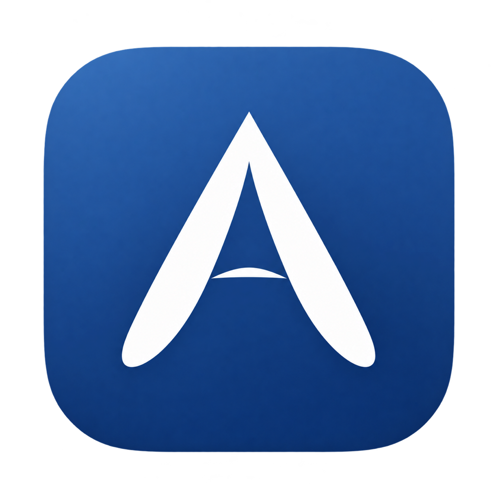

# Ashmactool

[](LICENSE)



Rust 编写的 macOS 菜单栏小工具箱。原生 AppKit 界面、单进程、没有 WebView，空闲时通过系统事件响应变化。

## 工具

| 工具 | 功能 |
| --- | --- |
| 指针样式 | 柔光 / 黑色 / 白色整套主题，覆盖文本、链接、拖动、缩放和忙碌等状态；支持 PNG / .cape 导入 |
| 保持屏幕唤醒 | 开关控制，防止闲置熄屏，关闭或退出时释放，重启应用默认关闭 |

指针尺寸有 **更小 / 小 / 中 / 大** 四档，画布分别为 **28 / 35 / 45.5 / 56 点**。相对上一版的 32 / 40 / 52 / 64 点，四档统一缩小 12.5%；已有设置自动迁移一次，图片热点同步缩放。实际图形小于画布，自定义 `.cape` 保留主题原有尺寸。

屏幕唤醒使用 macOS 的 `PreventUserIdleDisplaySleep` 电源请求，不修改全局休眠配置，也不启动 `caffeinate` 子进程。它防止闲置熄屏；合盖、手动睡眠和锁屏仍由系统处理。

## 下载与使用

在 GitHub [Releases](https://github.com/ashlikesky/Ashmactool/releases) 下载 `Ashmactool-macOS-arm64.zip`，解压，将 `Ashmactool.app` 拖入 `/Applications` 后打开。点击菜单栏的工具图标操作。

当前发布包针对 Apple Silicon。最低构建目标是 macOS 14，实际运行验证环境见 [VALIDATION.md](VALIDATION.md)。本地包为 ad hoc 签名，尚未使用 Developer ID 签名和公证；若系统提示无法验证开发者，使用系统设置 → 隐私与安全性中的“仍要打开”。

退出应用会恢复本工具保存的原始指针并释放屏幕唤醒请求。登录启动需要将应用放入固定位置，再使用菜单中的“登录时启动”。

## 系统指针覆盖

在当前 macOS 27.0 上，三套主题均注册了 **53 项系统指针定义**，其中包含同一状态的系统别名。运行时枚举系统名称和 CoreCursor ID，并初始化新版 AppKit 的行、列和窗口边角缩放指针。

覆盖箭头、横向/纵向文字插入、链接指示、抓取/抓握、复制/链接拖动、禁止操作、移动、十字线、单元格、截图相机、帮助、放大/缩小、水平/垂直调整、窗口四边和四角调整、上下计数、背景忙碌、系统沙滩球及消失操作。

保留各状态原本的形状、内部细节、热点和动画周期，统一黑白配色和柔光效果。隐藏指针保持隐藏。PNG 导入用于自定义箭头；整套主题和 `.cape` 可以覆盖多种状态。部分应用自行绘制或临时创建的指针可能不使用系统定义。

[查看三套主题的状态预览](previews/states.png)。预览展示首帧，实际忙碌和计数状态仍有动画。

## 主题与恢复

- `.cape` 支持 1–24 帧纵向动画条带、最多 4 份分辨率表示、逻辑尺寸不超过 64×64 点。
- 导入前验证完整文件；无法安全备份的系统指针名称保留原状。
- 修改前将原始指针保存到磁盘；恢复只处理本工具保存的名称。
- 系统沙滩球原生为 30 帧，注册接口最多接受 24 帧。主题与恢复均保留动画总时长；恢复原生外观时均匀选取 24 帧，不能逐帧还原 30 帧。完整原始数据单独保留在 `native-original.cape`，不会覆盖已有完整备份。
- 部分应用自行绘制指针，会覆盖系统主题。

设置、导入图片和恢复快照位于：

```text
~/Library/Application Support/Ashmactool/
```

应用异常退出后，下次启动会尝试恢复快照。也可以在关闭应用后执行：

```sh
/Applications/Ashmactool.app/Contents/MacOS/ashmactool --restore
```

## 构建与验证

需要 macOS、Xcode Command Line Tools 和 Rust 1.85 或更新版本。

```sh
git clone https://github.com/ashlikesky/Ashmactool.git
cd Ashmactool
cargo build --release --locked
cargo test --locked
cargo clippy --all-targets --locked -- -D warnings
cargo run --locked -- --doctor
cargo run --locked -- --preview-all /tmp/ashmactool-previews
cargo run --locked -- --power-self-test
cargo run --locked -- --self-test
cargo run --locked -- --ui-smoke-test
./scripts/package.sh
```

`--doctor`、`--inspect FILE.cape`、`--preview DIRECTORY`、`--preview-all DIRECTORY` 不替换当前系统指针。`--self-test` 短暂注册样式，回读并立即恢复，检查保存的原始像素（沙滩球使用上文说明的 24 帧恢复形式）。`--power-self-test` 创建电源请求，回读后立即释放。`--ui-smoke-test` 通过 AppKit 动作分发验证菜单，结束时恢复配置；不启用登录启动。指针测试需要先退出正在运行的本应用。

打包默认输出到项目上一级；可设置 `ASHMACTOOL_OUTPUT_DIR`。支持 `CARGO_TARGET_DIR`，无需将编译缓存放在源码目录。包内嵌入完整 `AppIcon.icns`；图标来源和提示词见 [assets/ICON.md](assets/ICON.md)。

## 代码结构

- `app.rs`：原生菜单、工具状态、导入和登录启动。
- `cursor.rs` / `graphics.rs`：指针注册、备份恢复和图像。
- `power.rs`：进程持有的 IOKit 电源请求，创建、回读和释放。
- `native.rs`：原生对象和 plist 文件操作。

## 参考与许可

参考 [Mousecape-swiftUI](https://github.com/sdmj76/Mousecape-swiftUI) 与原始 [Mousecape](https://github.com/alexzielenski/Mousecape) 的光标注册思路，Rust 实现独立编写，未打包上游 SwiftUI 代码、辅助程序或示例主题。参考版本和完整许可说明见 [THIRD_PARTY_NOTICES.md](THIRD_PARTY_NOTICES.md)。

本项目独立编写的 Rust 实现自 v0.3.1 起采用 [MIT 许可证](LICENSE)，允许使用、修改、再分发和商业使用，需保留版权及许可声明。第三方依赖与材料遵循各自许可；MIT 不重新授权上游 Mousecape 的代码。CGSInternal 接口声明的来源及许可已保留。欢迎通过 [Issues](https://github.com/ashlikesky/Ashmactool/issues) 反馈问题或提交 Pull Request，参与方式见 [CONTRIBUTING.md](CONTRIBUTING.md)。

指针替换依赖 Apple 私有接口，系统升级后可能需要兼容性更新。屏幕唤醒使用 Apple 的公开 [IOPMAssertionCreateWithName](https://developer.apple.com/documentation/iokit/1557134-iopmassertioncreatewithname) 接口。
